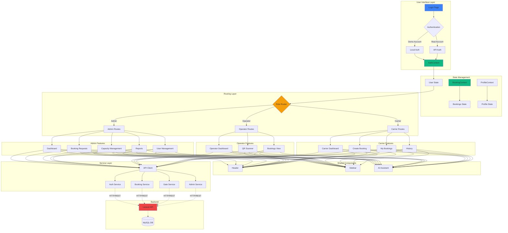
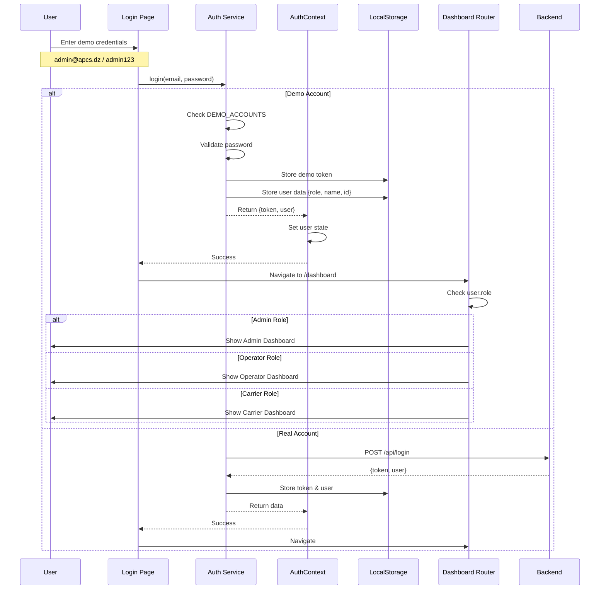
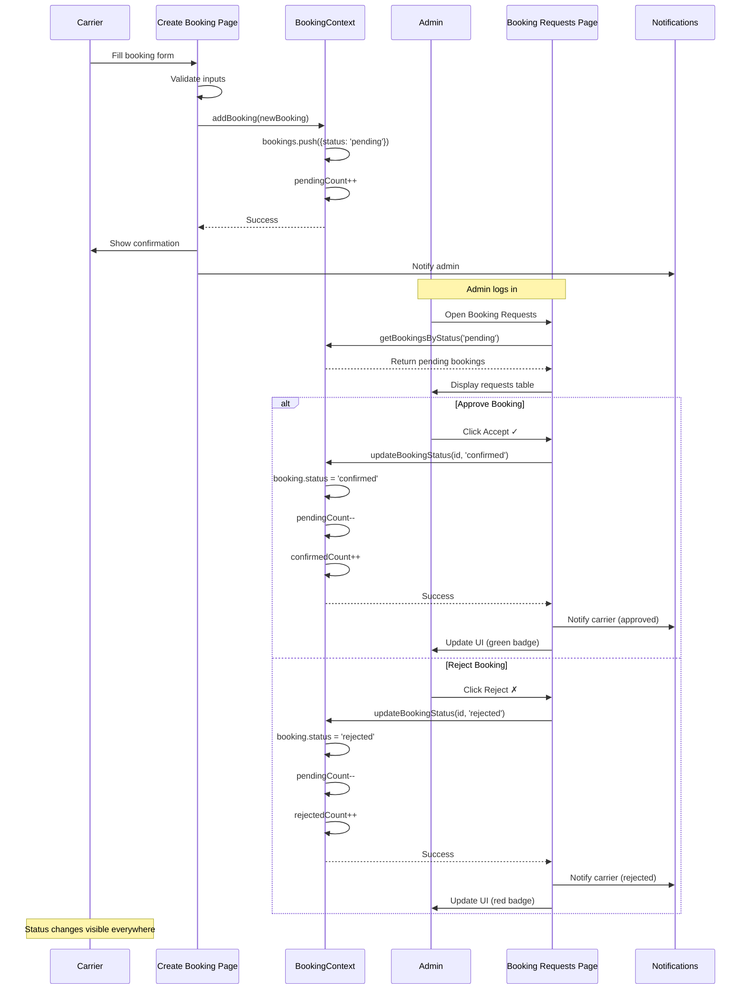
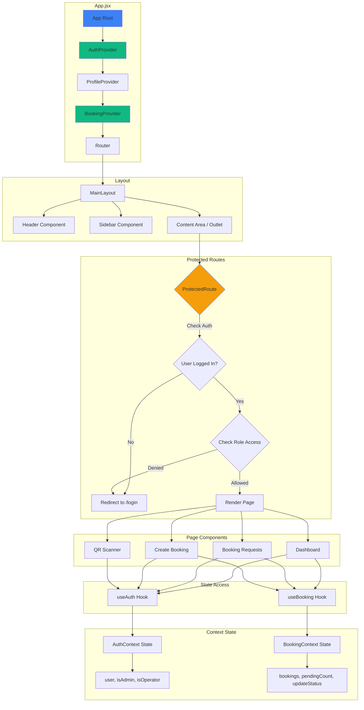
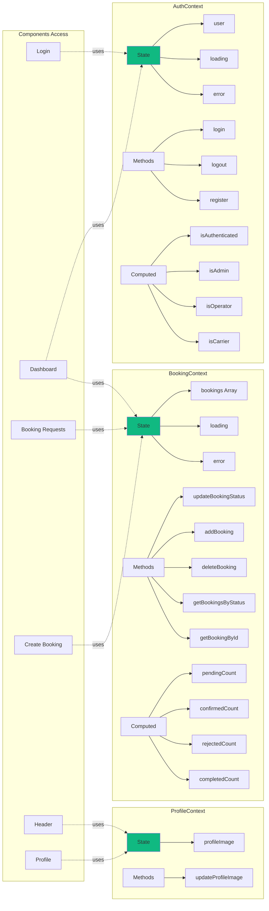
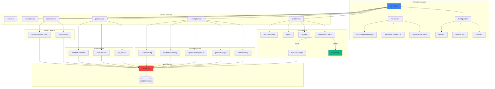
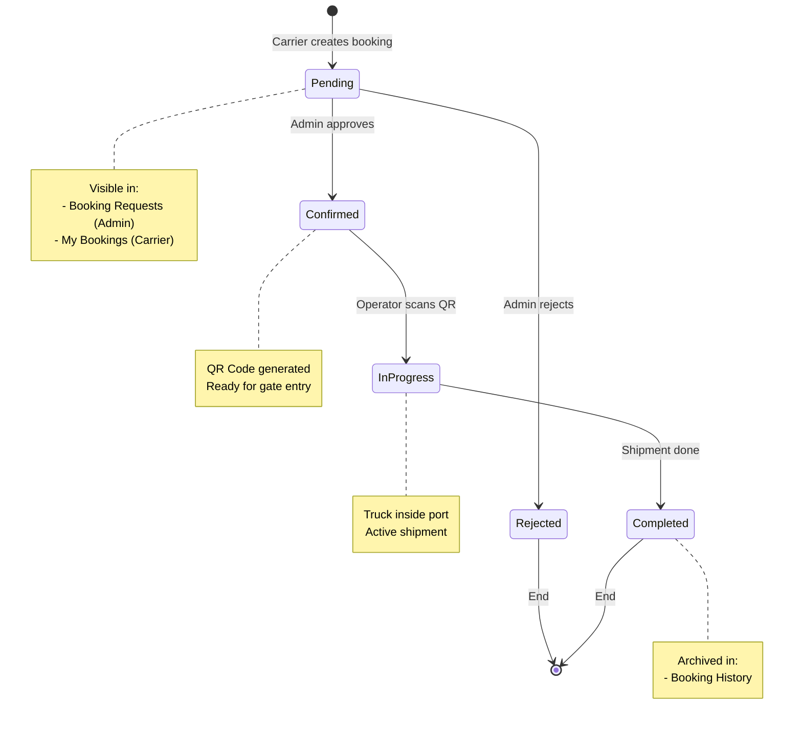
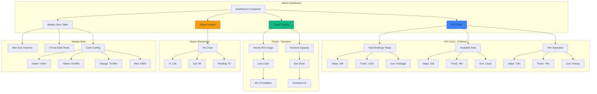

# APCS - Algerian Port Community System

<div align="center">


**Digital Control of Physical Flow**

A modern, role-based port booking management system for managing truck entries, time slots, and port operations.

[Demo](#-demo-accounts) | [Features](#-features) | [Installation](#-installation) | [Documentation](#-documentation)

</div>

---

## Overview

APCS (Algerian Port Community System) is a comprehensive frontend application designed to streamline port operations through intelligent logistics management. The system provides role-based access control with three distinct user roles, each with customized dashboards and permissions.

### Key Highlights

- **Real-time Booking Management** - Create, approve, and track port entry bookings
- **Role-Based Access Control** - Admin, Operator, and Carrier roles with specific permissions
- **QR Code Integration** - Generate and scan QR codes for seamless gate operations
- **Smart Capacity Management** - Monitor and manage port capacity in real-time
- **AI-Powered Assistant** - Integrated AI assistant for operational support
- **Demo Mode** - Fully functional demo accounts without backend dependency

---

## Demo Accounts

The application includes built-in demo accounts that work without a backend connection:

| Role         | Email              | Password      | Access Level       |
| ------------ | ------------------ | ------------- | ------------------ |
| **Admin**    | `admin@apcs.dz`    | `admin123`    | Full system access |
| **Operator** | `operator@apcs.dz` | `operator123` | Gate operations    |
| **Carrier**  | `carrier@apcs.dz`  | `carrier123`  | Booking management |

> **Note**: Demo accounts authenticate locally without API calls, perfect for testing and demonstrations.

---

## Features

### Admin Dashboard

- **Dashboard** - Real-time KPIs (Total Bookings, Available Slots, Port Saturation)
- **Capacity Management** - Configure daily capacity limits and time slots
- **Booking Requests** - Review and approve/reject booking requests from carriers
- **Booking History** - View all historical bookings
- **QR Scanner** - Scan and validate truck entries
- **Reports** - Analytics and operational reports
- **User Management** - Manage system users
- **Logs** - System activity logs

### Operator Dashboard

- **Dashboard** - Operational overview
- **Bookings** - View assigned bookings
- **QR Scanner** - Scan QR codes for truck entry validation

### Carrier Dashboard

- **Dashboard** - Personal booking overview
- **New Booking** - Create new port entry bookings
- **My Bookings** - View and manage personal bookings
- **History** - View booking history

### Shared Features

- **AI Assistant** - Natural language query support
- **Notifications** - Real-time alerts and updates
- **Profile** - Personal information management
- **Settings** - User preferences

---

## Tech Stack

| Technology       | Version | Purpose                 |
| ---------------- | ------- | ----------------------- |
| **React**        | 19.2.0  | UI Framework            |
| **Vite**         | 7.3.1   | Build Tool & Dev Server |
| **React Router** | 7.13.0  | Client-side Routing     |
| **TailwindCSS**  | 4.1.18  | Utility-first CSS       |
| **Recharts**     | 3.7.0   | Data Visualization      |
| **Lucide React** | 0.563.0 | Icon Library            |

---

## Installation

### Prerequisites

- **Node.js** >= 18.x
- **npm** >= 9.x

### Quick Start

```bash
# Clone the repository
git clone <repository-url>
cd frontendAMine

# Install dependencies
npm install

# Start development server
npm run dev
```

The application will be available at `http://localhost:5173`

### Environment Configuration

```bash
# Copy environment template
cp .env.example .env

# Edit .env with your API URL (optional for demo mode)
VITE_API_URL=http://localhost:8080/api
```

### Build for Production

```bash
# Create production build
npm run build

# Preview production build
npm run preview
```

---

## Project Structure

```
src/
├── components/                 # Reusable UI components
│   ├── Header.jsx             # Top navigation bar
│   ├── Sidebar.jsx            # Side navigation menu
│   ├── ProtectedRoute.jsx     # Route guard component
│   └── AIFloatingWidget.jsx   # Floating AI assistant
│
├── context/                   # React Context providers
│   ├── AuthContext.jsx        # Authentication state management
│   ├── ProfileContext.jsx     # User profile state
│   └── BookingContext.jsx     # Global booking state management
│
├── layouts/                   # Layout components
│   └── MainLayout.jsx         # Main application layout
│
├── pages/                     # Page components
│   ├── Login.jsx              # Login page with demo access
│   ├── Dashboard.jsx          # Admin dashboard
│   ├── Profile.jsx            # User profile page
│   │
│   ├── admin/                 # Admin-only pages
│   │   ├── BookingRequests.jsx    # Approve/reject bookings
│   │   ├── CapacityManagementNew.jsx
│   │   └── Reports.jsx
│   │
│   ├── operator/              # Operator-only pages
│   │   ├── OperatorDashboard.jsx
│   │   ├── OperatorBookingsView.jsx
│   │   └── QRScanner.jsx
│   │
│   └── transiteur/            # Carrier-only pages
│       ├── TransiteurDashboard.jsx
│       └── BookingHistory.jsx
│
├── services/                  # API service layer
│   ├── api.client.js          # HTTP client with auth
│   ├── auth.service.js        # Authentication (with demo support)
│   ├── booking.service.js     # Booking operations
│   └── ...
│
├── utils/                     # Utility functions
│   └── roleConfig.js          # Role-based menu configuration
│
├── App.jsx                    # Root component with providers
└── main.jsx                   # Application entry point
```

---

## Role Permissions

| Feature             |     Admin      | Operator | Carrier  |
| ------------------- | :------------: | :------: | :------: |
| Dashboard           |      Full      | Limited  | Personal |
| Booking Requests    | Approve/Reject |    -     |    -     |
| Create Booking      |       -        |    -     |   Yes    |
| View All Bookings   |      Yes       |   Yes    |    -     |
| View Own Bookings   |      Yes       |    -     |   Yes    |
| QR Scanner          |      Yes       |   Yes    |    -     |
| Capacity Management |      Yes       |    -     |    -     |
| User Management     |      Yes       |    -     |    -     |
| Reports             |      Yes       |    -     |    -     |
| AI Assistant        |      Yes       |   Yes    |   Yes    |

---

## Booking Workflow

```
1. Carrier creates booking request
         ↓
2. Admin reviews in "Booking Requests"
         ↓
3. Admin approves or rejects
         ↓
4. If approved → Status changes to "Confirmed"
         ↓
5. Carrier receives QR code
         ↓
6. Operator scans QR at gate
         ↓
7. Truck entry validated
```

---

## Available Scripts

```bash
# Development
npm run dev          # Start dev server with HMR

# Production
npm run build        # Build for production
npm run preview      # Preview production build

# Code Quality
npm run lint         # Run ESLint
```

---

## Docker Deployment

```bash
# Build Docker image
docker build -t apcs-frontend .

# Run container
docker run -p 5173:5173 apcs-frontend

# Or use convenience scripts
./docker-start.sh    # Linux/Mac
docker-start.bat     # Windows
```

### Docker Compose

```yaml
version: "3.8"
services:
  frontend:
    build: .
    ports:
      - "5173:5173"
    environment:
      - VITE_API_URL=http://backend:8080/api
```

---

## Key Components

### BookingContext

Global state management for bookings with real-time status updates:

- `bookings` - List of all bookings
- `updateBookingStatus(id, status)` - Update booking status
- `getBookingsByStatus(status)` - Filter bookings by status
- `pendingCount`, `confirmedCount`, `rejectedCount` - Status counts

### AuthContext

Authentication state with demo account support:

- `user` - Current user data
- `login(email, password)` - Authenticate user
- `logout()` - End session
- `isAdmin`, `isOperator`, `isCarrier` - Role checks

### ProtectedRoute

Route guard component for role-based access control.

---

## Browser Support

- Chrome (latest)
- Firefox (latest)
- Safari (latest)
- Edge (latest)

---

## Architecture Diagrams

### 1. Application Architecture Overview



### 2. Authentication Flow (Demo Mode)



### 3. Booking Request Workflow (Admin)



### 4. Component Hierarchy & Data Flow



### 5. State Management with Contexts



### 6. Role-Based Menu System

```mermaid
graph TB
    A[roleConfig.js] --> B[menuConfig Object]

    B --> C[Admin Menu]
    B --> D[Operator Menu]
    B --> E[Carrier Menu]

    C --> C1[Dashboard]
    C --> C2[Capacity Management]
    C --> C3[Booking Requests]
    C --> C4[Booking History]
    C --> C5[QR Scanner]
    C --> C6[Reports]
    C --> C7[Users]
    C --> C8[Logs]
    C --> C9[AI Assistant]
    C --> C10[Notifications]
    C --> C11[Profile]
    C --> C12[Settings]

    D --> D1[Dashboard]
    D --> D2[Bookings]
    D --> D3[QR Scanner]
    D --> D4[AI Assistant]
    D --> D5[Notifications]
    D --> D6[Profile]
    D --> D7[Settings]

    E --> E1[Dashboard]
    E --> E2[New Booking]
    E --> E3[My Bookings]
    E --> E4[History]
    E --> E5[AI Assistant]
    E --> E6[Notifications]
    E --> E7[Profile]
    E --> E8[Settings]

    subgraph "Sidebar Component"
        F[User Login] --> G{Get user.role}
        G -->|admin| C
        G -->|operator| D
        G -->|carrier| E
        C & D & E --> H[Map to Icons]
        H --> I[Render Menu Items]
    end

    style C fill:#ef4444
    style D fill:#f59e0b
    style E fill:#10b981
```



### 7. API Service Architecture



### 8. Booking Status Lifecycle



### 9. Dashboard KPI System (Admin)



---

<div align="center">

**APCS - Algerian Port Community System**

Digital Control of Physical Flow

Made with React + Vite + TailwindCSS

</div>
