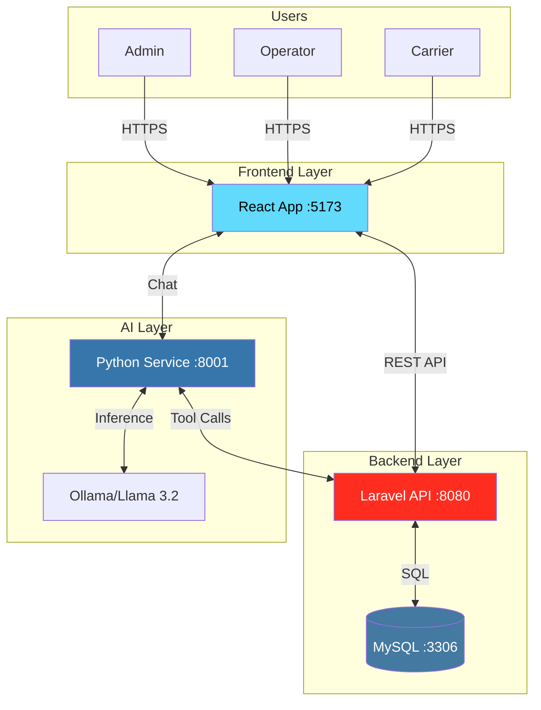
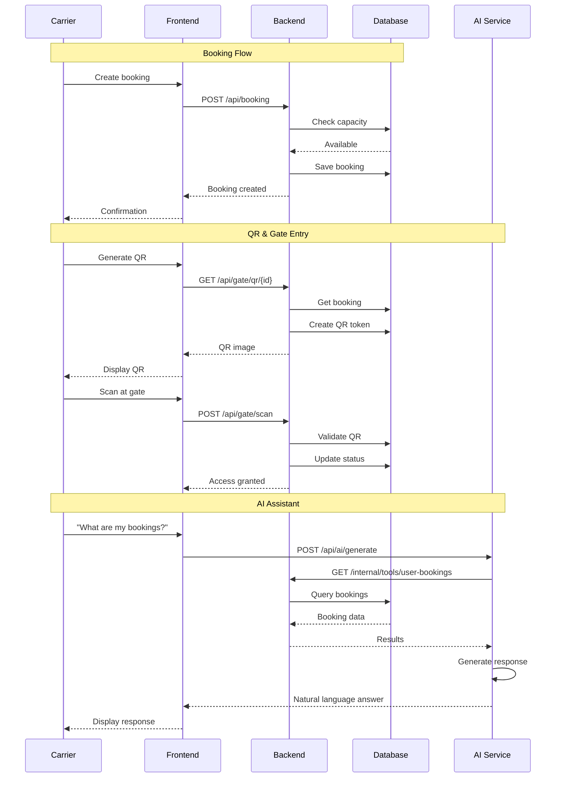
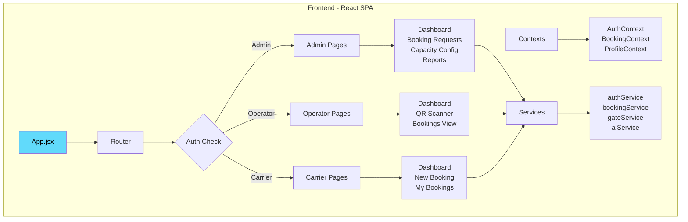
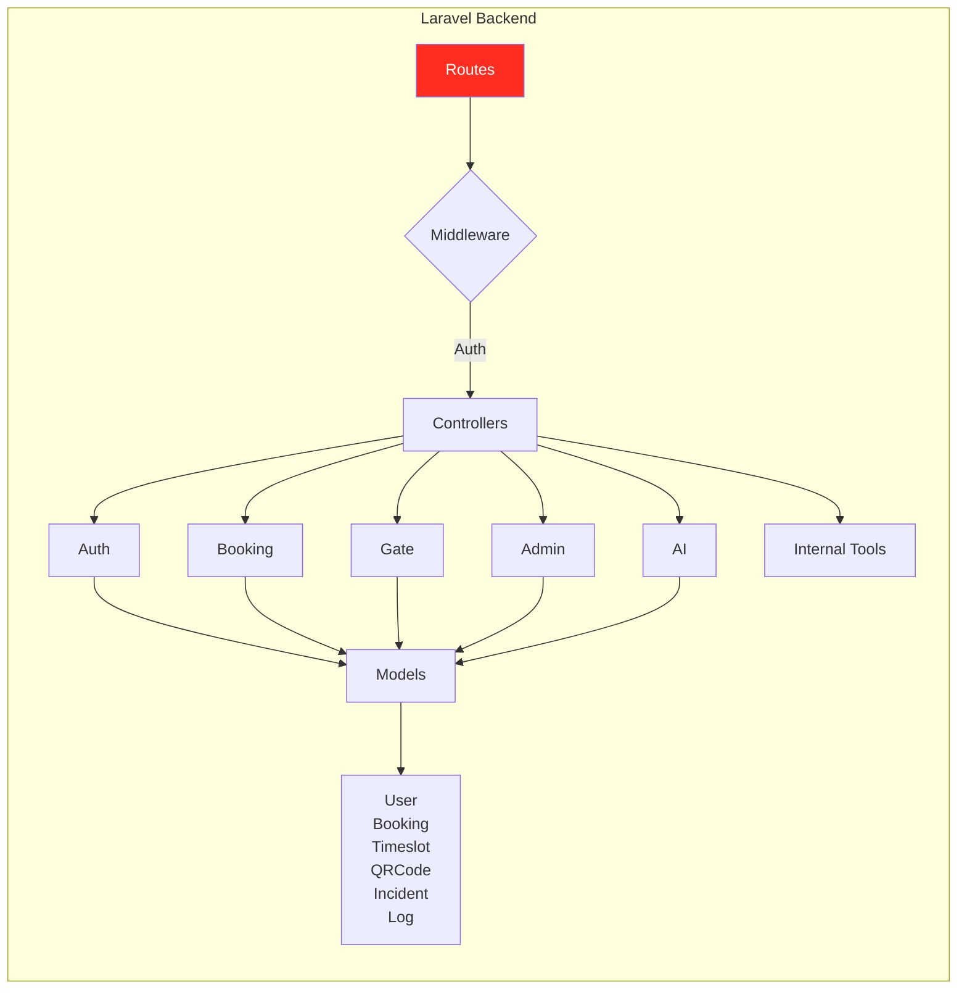
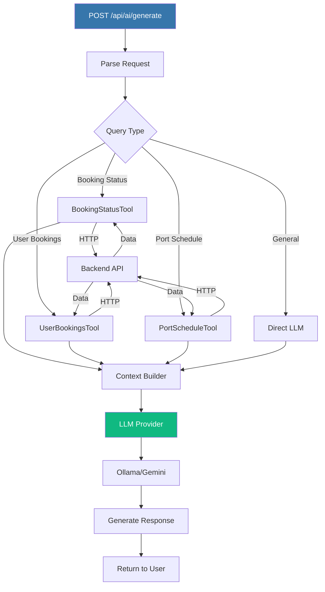
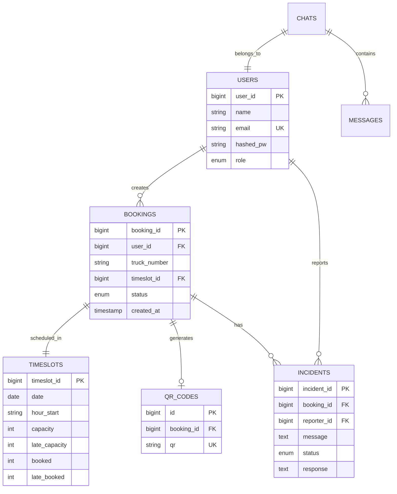
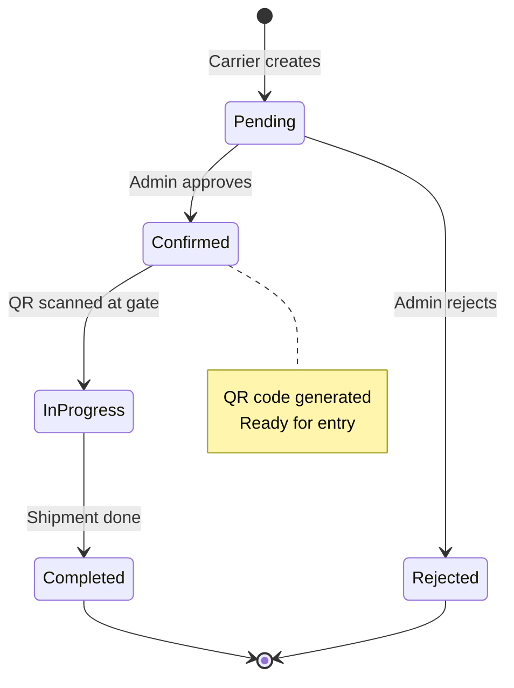
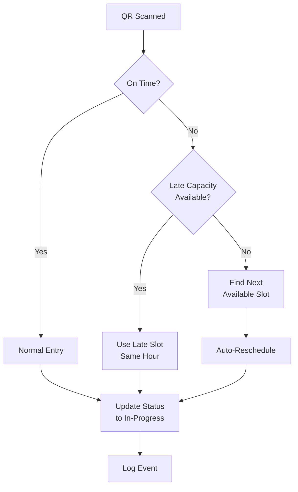

# APCS - Algerian Port Community System

### Hackathon Project | Digital Control of Physical Flow

<div align="center">

[](https://laravel.com)
[](https://react.dev)
[](https://python.org)
[](https://docker.com)

**AI-powered terminal management system for port operations with intelligent booking, QR-based gate access, and real-time capacity monitoring**

[Quick Start](#-quick-start) • [Architecture](#-system-architecture) • [Features](#-features) • [API Docs](#-api-overview)

</div>

---

## 📋 Overview

APCS is a full-stack port terminal management solution that streamlines logistics operations through intelligent automation. The system consists of three integrated components working together:

- **React Frontend** - Modern UI with role-based dashboards
- **Laravel Backend** - Robust API with business logic
- **Python AI Service** - Intelligent assistant for operational queries

### The Problem

Traditional port operations suffer from manual booking processes, inefficient capacity utilization, lack of real-time visibility, and time-consuming gate operations.

### Our Solution

Automated booking with intelligent scheduling, QR code-based gate access, AI-powered assistance, real-time capacity monitoring, and role-based access control.

---

## 🏗️ System Architecture



### Data Flow



---

## ✨ Features

### 🎭 Role-Based Access

| Role         | Capabilities                                                        |
| ------------ | ------------------------------------------------------------------- |
| **Admin**    | Approve bookings • Configure capacity • View reports • Manage users |
| **Operator** | Scan QR codes • Process gate entries • View bookings                |
| **Carrier**  | Create bookings • Generate QR codes • Track status                  |

### 🚀 Core Capabilities

- **Smart Booking** - Dynamic timeslot selection with real-time capacity
- **QR Gate Access** - Secure one-time tokens for seamless entry
- **Late Arrival Handling** - Auto-reschedule to available late capacity slots
- **AI Assistant** - Natural language queries about bookings and schedules
- **Incident Management** - Track and resolve operational issues
- **Audit Logging** - Complete activity trail for compliance

---

## 🛠️ Tech Stack

### Frontend

React 19 • Vite 7 • React Router 7 • TailwindCSS 4 • Recharts • Lucide Icons

### Backend

Laravel 12 • PHP 8.1+ • MySQL 8.4 • JWT Authentication

### AI Service

Python 3.11+ • FastAPI • Ollama • Llama 3.2

### Infrastructure

Docker • Docker Compose

---

## 🚀 Quick Start

### Prerequisites

```bash
Docker & Docker Compose
Git
8GB+ RAM (for LLM)
```

### Installation

**1. Clone Repositories**

```bash
git clone https://github.com/APCSLogistique/Frontend.git frontend
git clone https://github.com/APCSLogistique/Backend.git backend
git clone https://github.com/APCSLogistique/AI-Service.git ai-service
```

**2. Setup Backend**

```bash
cd backend
cp .env.example .env
# Edit .env: DB credentials, AI service URL, capacity settings

docker-compose up -d --build
docker-compose exec app php artisan key:generate
docker-compose exec app php artisan migrate
docker-compose exec app php artisan db:init
```

**3. Setup AI Service**

```bash
cd ../ai-service
cp .env.example .env
# Edit .env:
# API_BASE_URL=http://backend:8080
# API_SERVICE_TOKEN=your-secure-token
# OLLAMA_BASE_URL=http://ollama:11434
# OLLAMA_MODEL=llama3.2

docker build -t apcs-ai-service .
docker run -d --name ai-service -p 8001:8001 --env-file .env apcs-ai-service
```

**4. Setup Frontend**

```bash
cd ../frontend
npm install
cp .env.example .env
# Edit .env: VITE_API_URL=http://localhost:8080/api

npm run dev
```

### Access Points

| Service         | URL                       |
| --------------- | ------------------------- |
| **Frontend**    | http://localhost:5173     |
| **Backend API** | http://localhost:8080/api |
| **AI Service**  | http://localhost:8001     |

---

## 🏗️ Component Architecture

### Frontend Structure



### Backend Architecture



### AI Service Flow



---

## 📊 Database Schema



---

## 🔄 Key Workflows

### Booking Lifecycle



### Late Arrival Logic



---

## 📡 API Overview

**Base URL:** `http://localhost:8080/api`

### Key Endpoints

| Category     | Method | Endpoint                        | Auth     | Description       |
| ------------ | ------ | ------------------------------- | -------- | ----------------- |
| **Auth**     | POST   | `/login`                        | None     | Authenticate      |
| **User**     | GET    | `/user/profile`                 | User     | Get profile       |
| **Booking**  | POST   | `/booking`                      | Carrier  | Create booking    |
|              | GET    | `/booking/{id}`                 | Admin    | Get details       |
|              | PUT    | `/booking/{id}/status`          | Carrier  | Update status     |
|              | PUT    | `/booking/{id}/reschedule`      | Carrier  | Reschedule        |
| **Gate**     | GET    | `/gate/qr/{id}`                 | Carrier  | Generate QR       |
|              | POST   | `/gate/scan`                    | Operator | Scan QR           |
| **Admin**    | GET    | `/admin/schedule`               | Admin    | Get schedule      |
|              | POST   | `/admin/config/capacity`        | Admin    | Set capacity      |
| **AI**       | GET    | `/chat`                         | User     | New chat          |
|              | POST   | `/ai/generate`                  | User     | Get AI response   |
| **Internal** | POST   | `/internal/tools/user-bookings` | Service  | Get bookings (AI) |

### Example Requests

**Create Booking**

```bash
curl -X POST http://localhost:8080/api/booking \
  -H "Authorization: Bearer {token}" \
  -H "Content-Type: application/json" \
  -d '{
    "truck_number": "TRK-001",
    "user_id": 1,
    "timeslot": {"date": "2024-02-07", "hour_start": "14"}
  }'
```

**Ask AI Assistant**

```bash
curl -X POST http://localhost:8080/api/ai/generate \
  -H "Authorization: Bearer {token}" \
  -H "Content-Type: application/json" \
  -d '{
    "chat_id": "chat_123",
    "message": "What are my bookings today?"
  }'
```

---

## 🎯 Use Cases

### 1. Daily Booking

1. Carrier creates booking for tomorrow at 14:00
2. Admin reviews and approves
3. Carrier generates QR code
4. Driver shows QR at gate
5. Operator scans → Gate opens
6. After shipment, operator marks complete

### 2. Late Arrival

1. Truck scheduled for 14:00 arrives at 16:00
2. Operator scans QR
3. System detects late arrival
4. Auto-checks late capacity (2 slots available)
5. Uses late slot in current hour
6. Updates booking status
7. Logs the event

### 3. AI Query

1. User asks: "Do I have bookings this week?"
2. AI Service calls UserBookingsTool
3. Tool queries backend
4. Backend returns booking data
5. AI generates response: "You have 3 bookings: Monday 14:00, Wednesday 10:00, Friday 16:00"

---

## 🔧 Configuration

### Backend (.env)

```env
APP_URL=http://localhost:8080
DB_HOST=db
DB_DATABASE=apcs_terminal
DB_USERNAME=apcs_user
DB_PASSWORD=your_password

DEFAULT_CAPACITY=10
DEFAULT_LATE_CAPACITY=2

AI_SERVICE_URL=http://ai-service:8001/api
AI_SERVICE_TOKEN=your-internal-token
```

### Frontend (.env)

```env
VITE_API_URL=http://localhost:8080/api
```

### AI Service (.env)

```env
API_BASE_URL=http://backend:8080
API_SERVICE_TOKEN=your-internal-token
OLLAMA_BASE_URL=http://ollama:11434
OLLAMA_MODEL=llama3.2
```

---

## 🐳 Docker Compose (All-in-One)

```yaml
version: "3.8"
services:
  db:
    image: mysql:8.4
    environment:
      MYSQL_DATABASE: apcs_terminal
      MYSQL_USER: apcs_user
      MYSQL_PASSWORD: secure_pass
    ports: ["3306:3306"]

  backend:
    build: ./backend
    ports: ["8080:8080"]
    depends_on: [db]

  ollama:
    image: ollama/ollama:latest
    ports: ["11434:11434"]

  ai-service:
    build: ./ai-service
    ports: ["8001:8001"]
    depends_on: [backend, ollama]

  frontend:
    build: ./frontend
    ports: ["5173:5173"]
    depends_on: [backend]
```

**Run:** `docker-compose up -d --build`

---

## 🛠️ Common Commands

```bash
# Backend
docker-compose exec app php artisan migrate
docker-compose exec app php artisan db:init

# Pull LLM model
docker-compose exec ollama ollama pull llama3.2

# View logs
docker-compose logs -f backend
docker-compose logs -f ai-service

# Stop all
docker-compose down
```

---

## 🔍 Troubleshooting

**Database connection failed**

- Use `DB_HOST=db` not `localhost`
- Check: `docker-compose ps`

**AI Service not responding**

- Ensure Ollama is running
- Pull model: `ollama pull llama3.2`
- Verify service token matches

**QR generation fails**

- Booking must be `confirmed` status
- Check booking exists

**CORS errors**

- Backend must allow frontend URL
- Check Laravel CORS config

---

## 📝 Key Features Summary

✅ **Automated Booking** - Smart scheduling with capacity management  
✅ **QR Gate Access** - Secure, one-time entry tokens  
✅ **Late Handling** - Auto-reschedule to available slots  
✅ **AI Assistant** - Natural language operational support  
✅ **Real-time Tracking** - Live capacity and status updates  
✅ **Incident Management** - Track and resolve issues  
✅ **Audit Logging** - Complete activity trail  
✅ **Role-Based Access** - Admin, Operator, Carrier permissions

---

## 📄 License

## MIT License
